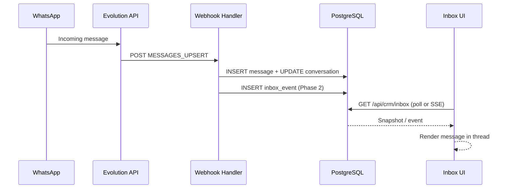
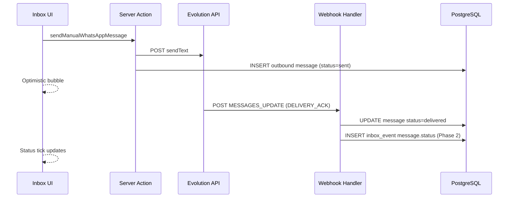

# Inbox Flow Design Spec

**Date:** 2026-06-08  
**Status:** Approved  
**Scope:** WhatsApp inbox flow lengkap — receive, display, send, status update, realtime  
**Deploy target:** Vercel / serverless  
**Engine:** Evolution API (webhook → PostgreSQL → Mocci CRM UI)

---

## Goals

1. Pesan masuk dari WhatsApp tersimpan dan tampil di `/crm/inbox`.
2. Admin bisa membalas pesan dari inbox.
3. Status pesan outbound (sent → delivered → read) tampil di UI.
4. Inbox terasa realtime tanpa full page refresh.
5. Arsitektur kompatibel dengan deploy Vercel serverless.

## Non-Goals

- Media messages (image/video/document) — text-first untuk fase ini.
- Multi-instance selector.
- Typing indicator / presence.
- Mark-as-read via Evolution API.
- Auth/role guard untuk server actions (deferred).
- Mengganti arsitektur webhook → DB dengan live fetch dari Evolution API.

---

## Current State

| Area | Status |
|------|--------|
| Receive (`MESSAGES_UPSERT`) | Implemented — webhook inserts to DB |
| Display (conversation list + thread) | Implemented — `/crm/inbox` via `getInboxSnapshot()` |
| Send (manual reply) | Implemented — `sendManualWhatsAppMessage` via Evolution API |
| Optimistic UI on send | Implemented — `createOptimisticMessage` |
| Load older messages | Implemented — pagination via `before` query param |
| Auto-refresh | Polling every 10s via `/api/crm/inbox` |
| Status update (`MESSAGES_UPDATE`) | **Not implemented** |
| Realtime push | **Not implemented** |

### Key existing files

- `src/app/api/webhooks/evolution/route.ts` — webhook handler (UPSERT only)
- `src/app/api/crm/inbox/route.ts` — inbox snapshot API
- `src/server/crm/inbox-snapshot.ts` — DB → UI DTO mapping
- `src/app/crm/inbox/crm-chat-workspace.tsx` — inbox layout + polling
- `src/app/crm/inbox/crm-chat-thread.tsx` — thread + composer
- `src/app/crm/inbox/actions.ts` — `sendManualWhatsAppMessage`
- `src/server/db/schema.ts` — `messages.status` column exists (text)

---

## Architecture

```text
Evolution API
  └── POST /api/webhooks/evolution
        ├── MESSAGES_UPSERT   → insert message + update conversation
        ├── MESSAGES_UPDATE   → update messages.status (Phase 1)
        └── publish inbox_event → INSERT inbox_events (Phase 2)

PostgreSQL (source of truth)
  ├── contacts
  ├── conversations
  ├── messages
  ├── webhook_events
  └── inbox_events (NEW, Phase 2)

Next.js on Vercel
  ├── GET /api/crm/inbox          → full snapshot (existing)
  ├── GET /api/crm/inbox/stream   → SSE over DB polling (NEW, Phase 2)
  └── /crm/inbox                  → client workspace UI
```

### Design principles

- **DB is source of truth** — UI reads from PostgreSQL, not live Evolution API.
- **Webhook writes, UI reads** — Evolution events mutate DB; UI consumes snapshots/events.
- **Serverless-safe realtime** — no in-memory pub/sub; SSE polls `inbox_events` table.
- **Graceful degradation** — polling 10s remains as fallback when SSE disconnects.

---

## Phase 1 — Message Status Update

### Objective

Handle Evolution `MESSAGES_UPDATE` webhook to update outbound message delivery status and display it in chat bubbles.

### Status mapping

| Evolution ACK | DB `messages.status` | UI `ChatMessageData.status` |
|---------------|----------------------|----------------------------|
| `PENDING`, `SERVER_ACK` | `sent` | `sent` |
| `DELIVERY_ACK` | `delivered` | `delivered` |
| `READ`, `PLAYED` | `read` | `read` |
| `ERROR` | `failed` | `failed` |
| Inbound (no ACK) | `received` | `delivered` |

Status transitions are monotonic for outbound: `sent` → `delivered` → `read`. Never downgrade (e.g. `read` → `sent`).

### Webhook flow

```text
POST /api/webhooks/evolution (MESSAGES_UPDATE)
  → extract evolutionMessageId + ACK status from payload
  → map ACK → normalized status via message-status.ts
  → UPDATE messages SET status = ? WHERE evolution_message_id = ?
  → if no row found: log warning, skip (idempotent)
  → revalidatePath /crm/inbox
```

### New module: `src/server/crm/message-status.ts`

Responsibilities:

- `extractAckStatus(payload: unknown): string | undefined`
- `mapAckToMessageStatus(ack: string): MessageStatus`
- `shouldUpdateStatus(current: string, next: string): boolean` — monotonic check

### File changes

| File | Change |
|------|--------|
| `src/server/crm/message-status.ts` | **NEW** — ACK extraction and mapping |
| `src/server/crm/message-status.test.ts` | **NEW** — unit tests for mapping + monotonic rules |
| `src/app/api/webhooks/evolution/route.ts` | Add `processMessageUpdate()`, call from `handleEvolutionWebhook` |
| `src/app/api/webhooks/evolution/evolution-message.ts` | Add `getEvolutionMessageId()`, `getEvolutionAckStatus()` helpers |
| `src/server/crm/inbox-snapshot.ts` | Map `message.status` from DB instead of hardcoding `"sent"` / `"delivered"` |
| `src/app/crm/inbox/crm-chat-thread.tsx` | Sync `initialMessages` prop changes via `useEffect` |
| `src/app/crm/inbox/crm-chat-workspace.tsx` | Pass updated messages to thread on refresh |

### Error handling

| Case | Behavior |
|------|----------|
| Message not found in DB | Log warning, return 0 processed (idempotent) |
| Unknown ACK value | Log, keep current status, store raw in `rawMetadata` |
| Duplicate webhook | Idempotent UPDATE (same status, no error) |
| Invalid JSON body | Existing `invalid_json` flow unchanged |

### Testing (Phase 1)

- Unit: ACK → status mapping for all known values
- Unit: monotonic transition rules (`read` cannot become `sent`)
- Integration: mock webhook POST with `MESSAGES_UPDATE` → verify DB update
- Manual: send message from inbox → observe status change in bubble

---

## Phase 2 — Realtime SSE (Vercel-compatible)

### Objective

Push inbox updates to browser without waiting for 10s polling cycle.

### Why DB-backed SSE (not in-memory)

Vercel serverless functions:

- Cannot share in-memory state across instances.
- SSE connections timeout (~55s on hobby, configurable on pro).
- Multiple webhook invocations may land on different instances than SSE consumer.

Solution: webhook writes events to `inbox_events` table; SSE route polls DB and streams new events.

### New table: `inbox_events`

```typescript
inbox_events {
  id: uuid PK defaultRandom()
  eventType: text NOT NULL  // "message.new" | "message.status" | "conversation.updated"
  conversationId: uuid REFERENCES conversations(id)
  payload: jsonb NOT NULL
  createdAt: timestamp with timezone NOT NULL defaultNow()
}

// Index: (createdAt ASC) for cursor-based polling
// Index: (conversationId, createdAt) for filtered streams (optional)
```

Migration via Drizzle Kit: `drizzle-kit generate` + `drizzle-kit migrate`.

### Event types

| eventType | Trigger | payload shape |
|-----------|---------|---------------|
| `message.new` | `MESSAGES_UPSERT` processed | `{ messageId, conversationId, direction, text, senderName, timestamp }` |
| `message.status` | `MESSAGES_UPDATE` processed | `{ messageId, evolutionMessageId, status }` |
| `conversation.updated` | conversation summary/unread changed | `{ conversationId, lastMessageSummary, lastMessageAt, unreadCount }` |

### Publish helper: `src/server/crm/inbox-events.ts`

```typescript
export async function publishInboxEvent(
  eventType: InboxEventType,
  conversationId: string,
  payload: Record<string, unknown>,
): Promise<void>
```

Called from webhook handler after successful DB mutation (UPSERT or UPDATE).

### SSE endpoint: `src/app/api/crm/inbox/stream/route.ts`

```text
GET /api/crm/inbox/stream?since=<eventId>
```

Behavior:

1. Parse `since` query param (UUID of last received event, optional).
2. Open `ReadableStream` with `text/event-stream` content type.
3. Poll `inbox_events` every 1 second for rows with `id > since` (or `createdAt > sinceTime`).
4. Write each event as SSE: `id: <uuid>\nevent: <type>\ndata: <json>\n\n`.
5. Send heartbeat comment `: ping\n\n` every 15s to keep connection alive.
6. Close stream after 55 seconds (before Vercel timeout).
7. Client `EventSource` auto-reconnects; browser sends `Last-Event-ID` header.

Route config:

```typescript
export const dynamic = "force-dynamic";
export const runtime = "nodejs";
export const maxDuration = 60; // Vercel Pro; 10 on hobby
```

### Client hook: `src/app/crm/inbox/use-inbox-stream.ts`

```typescript
function useInboxStream(options: {
  onMessageNew: (event: MessageNewEvent) => void;
  onMessageStatus: (event: MessageStatusEvent) => void;
  onConversationUpdated: (event: ConversationUpdatedEvent) => void;
  enabled: boolean;
}): { connected: boolean }
```

Behavior:

- Opens `EventSource` to `/api/crm/inbox/stream`.
- Parses incoming events and calls callbacks.
- On `connected`: parent pauses 10s polling.
- On disconnect/error: parent resumes polling.
- Reconnects automatically via `EventSource` built-in retry.

### Integration in `crm-chat-workspace.tsx`

```text
useInboxStream({ enabled: true, ...callbacks })
  → onMessageNew: append to messages if active conversation matches
  → onMessageStatus: update message.status in local state
  → onConversationUpdated: update conversation preview in sidebar

Polling interval:
  → 10s when SSE disconnected
  → 30s when SSE connected (safety net only)
```

### Error handling (Phase 2)

| Case | Behavior |
|------|----------|
| SSE connection drops | Client auto-reconnect; polling resumes immediately |
| DB poll returns no events | Continue polling inside stream (no output) |
| Malformed event payload | Log error, skip event, continue stream |
| `inbox_events` insert fails | Log error; inbox still works via polling |

### Testing (Phase 2)

- Unit: `publishInboxEvent` inserts correct row
- Unit: SSE stream formats events correctly
- Integration: webhook UPSERT → event published → SSE client receives `message.new`
- Manual: open inbox, send WhatsApp message from phone → message appears without refresh

### Cleanup (deferred)

- TTL job to delete `inbox_events` older than 7 days.
- Not required for initial release; table growth is low for single-instance CRM.

---

## Data Flow Diagrams

### Receive + Display



### Send + Status



---

## Implementation Order

| # | Task | Phase | Est. |
|---|------|-------|------|
| 1 | `message-status.ts` + unit tests | 1 | 30 min |
| 2 | Webhook `MESSAGES_UPDATE` handler | 1 | 45 min |
| 3 | `inbox-snapshot.ts` read DB status | 1 | 20 min |
| 4 | UI sync messages + show status ticks | 1 | 30 min |
| 5 | Drizzle migration `inbox_events` | 2 | 20 min |
| 6 | `inbox-events.ts` publish helper | 2 | 30 min |
| 7 | Webhook publish events on UPSERT/UPDATE | 2 | 30 min |
| 8 | SSE endpoint `/api/crm/inbox/stream` | 2 | 60 min |
| 9 | `use-inbox-stream.ts` client hook | 2 | 45 min |
| 10 | Integrate SSE into `crm-chat-workspace` | 2 | 30 min |
| 11 | E2E manual verification | both | 30 min |

**Total estimate: ~5–6 hours**

---

## Verification Checklist

### Phase 1

- [ ] Send message from inbox → status shows `sent`
- [ ] Recipient receives → status updates to `delivered` (via webhook)
- [ ] Recipient reads → status updates to `read`
- [ ] Failed send → status shows `failed`
- [ ] `npm test` passes
- [ ] `npm run lint` passes
- [ ] `npm run build` passes

### Phase 2

- [ ] Incoming WhatsApp message appears in inbox without manual refresh
- [ ] SSE reconnects after 55s timeout
- [ ] Polling resumes when SSE fails
- [ ] Conversation list updates when new message arrives
- [ ] Status update reflected in real time via SSE
- [ ] No duplicate messages on SSE + polling overlap

---

## Risks and Mitigations

| Risk | Mitigation |
|------|------------|
| Vercel SSE timeout | 55s stream + auto-reconnect; polling fallback |
| SSE + polling duplicate updates | Dedupe by `messageId` / `eventId` in client state |
| `MESSAGES_UPDATE` payload shape varies | Defensive extraction with multiple path fallbacks (same pattern as UPSERT) |
| `inbox_events` table growth | Low volume for single CRM; cleanup job deferred |
| Outbound message missing `evolutionMessageId` | Store Evolution response ID in `sendManualWhatsAppMessage` for status matching |

---

## Open Items (Future)

- Store `evolutionMessageId` from send response for reliable status matching
- Media message support (image caption, document)
- Mark conversation as read via Evolution `markMessageAsRead`
- Auth guard on inbox server actions
- `inbox_events` TTL cleanup cron
