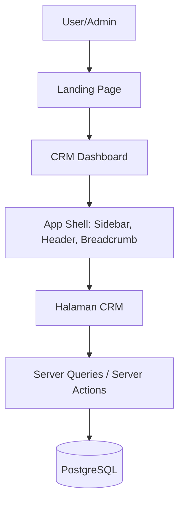
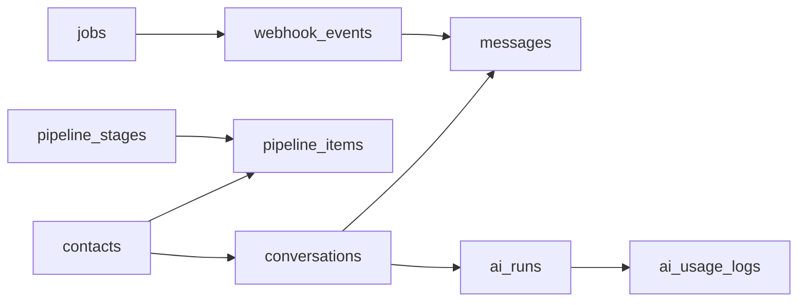
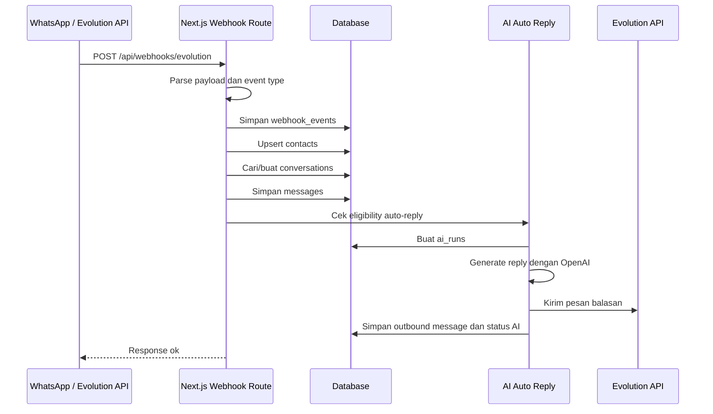
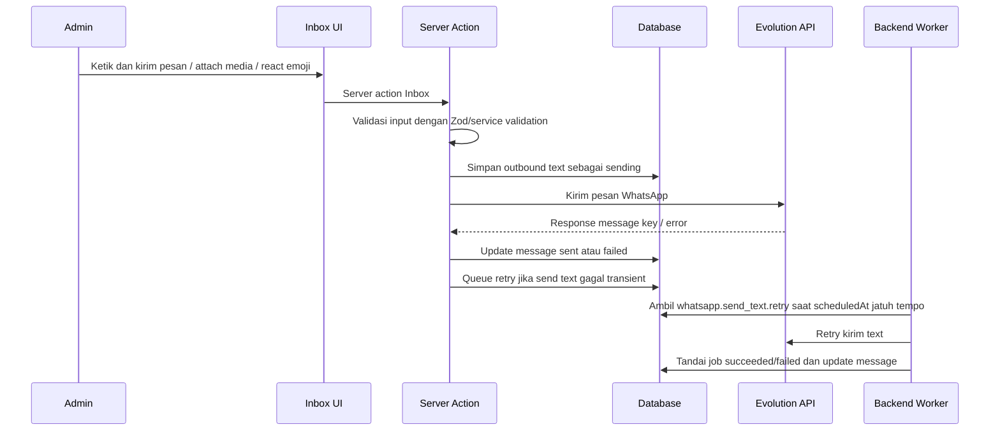
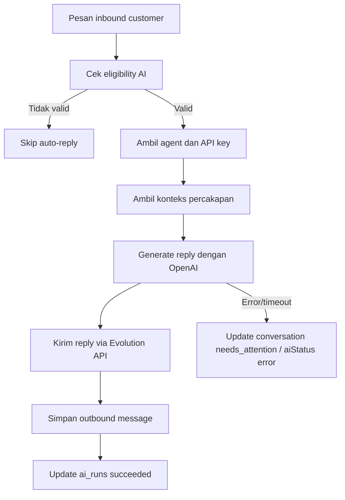
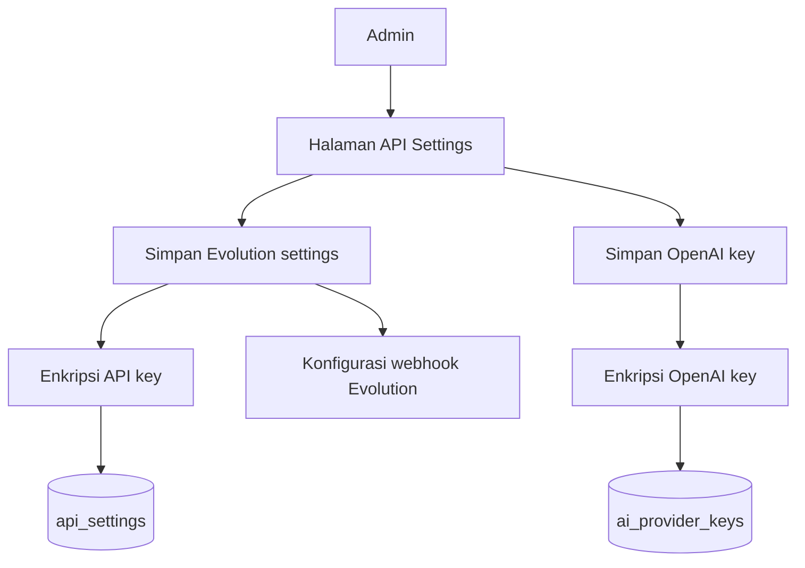
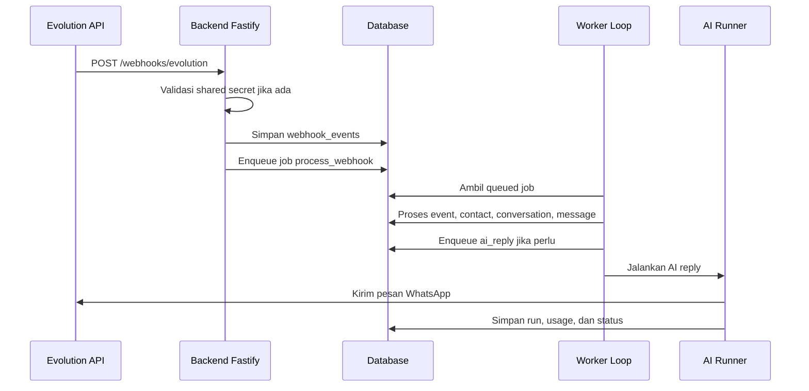
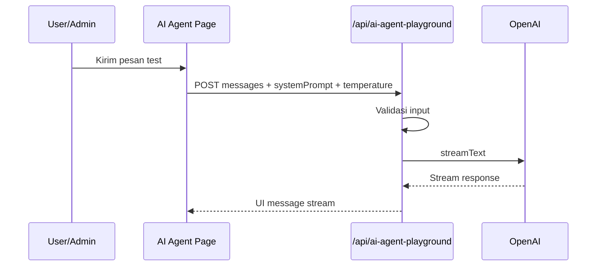
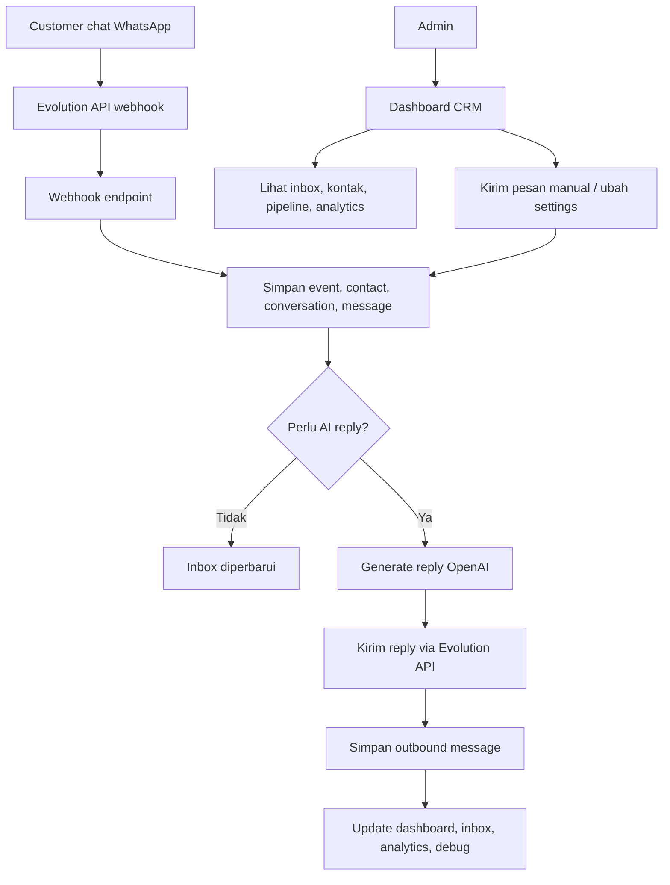

# Flow Sistem Mocci CRM Dashboard

Dokumen ini merangkum alur kerja utama sistem secara ringkas agar mudah dipahami oleh developer, admin, atau stakeholder teknis.

## 1. Gambaran Umum

Mocci CRM Dashboard adalah aplikasi admin CRM berbasis **Next.js 16** untuk mengelola percakapan WhatsApp, kontak, pipeline penjualan, pengaturan API, dan auto-reply AI.

Secara besar, sistem terdiri dari:

- **Frontend Dashboard**: halaman CRM, inbox, kontak, pipeline, analytics, debug, dan settings.
- **Next.js API Routes / Server Actions**: menerima webhook, mengirim pesan manual, menjalankan playground AI, dan menyimpan konfigurasi.
- **Database PostgreSQL + Drizzle ORM**: menyimpan kontak, percakapan, pesan, konfigurasi, AI run, biaya token, webhook event, dan job queue.
- **Evolution API**: integrasi WhatsApp untuk menerima webhook dan mengirim pesan.
- **AI Provider OpenAI**: membuat balasan otomatis berdasarkan pesan pelanggan.
- **Backend Fastify Worker**: alternatif backend terpisah untuk menerima webhook dan memproses job queue.

## 2. Struktur Modul Utama

```text
src/
├── app/                    # Next.js App Router
│   ├── crm/                # Halaman CRM utama
│   ├── api/                # API routes Next.js
│   └── layout.tsx          # Root layout, theme provider, toaster
├── components/             # Komponen UI reusable dan app shell
├── config/                 # Navigasi, workspace, theme preset
├── server/                 # Query CRM, integrasi Evolution, AI, database
└── server/db/schema.ts     # Skema database Drizzle

backend/
└── src/                    # Backend Fastify + worker queue opsional
```

## 3. Flow Aplikasi Dashboard



Alurnya:

1. User membuka aplikasi.
2. Root layout memasang theme provider, font, metadata, dan toaster.
3. User masuk ke halaman CRM seperti dashboard, inbox, contacts, pipeline, AI agent, analytics, API settings, atau debug.
4. Layout CRM menggunakan app shell berisi sidebar, header, breadcrumb, dan footer.
5. Halaman mengambil data melalui server query atau server action.
6. Data dibaca atau ditulis ke PostgreSQL lewat Drizzle ORM.

## 4. Flow Navigasi CRM

Navigasi CRM dikendalikan oleh `src/config/nav.ts`.

Menu utama:

- **Dashboard**: ringkasan kontak, percakapan, pesan, biaya AI, dan status CRM.
- **Inbox**: daftar percakapan dan chat thread WhatsApp.
- **Contacts**: data kontak/customer.
- **Pipeline**: board pipeline lead/deal.
- **AI Agent**: playground dan konfigurasi perilaku AI.
- **Analytics**: metrik performa CRM.
- **API Settings**: konfigurasi Evolution API dan OpenAI key.
- **Debug & Logs**: status webhook, event, dan log teknis.

## 5. Flow Data CRM



Entitas penting:

- `contacts`: identitas pelanggan dari WhatsApp.
- `conversations`: sesi percakapan aktif per kontak.
- `messages`: pesan inbound/outbound dari customer, admin, atau AI.
- `ai_agents`: konfigurasi agent AI.
- `ai_runs`: riwayat proses AI saat membuat balasan.
- `ai_usage_logs`: token dan estimasi biaya AI.
- `api_settings`: konfigurasi Evolution API dan webhook.
- `ai_provider_keys`: API key AI terenkripsi.
- `pipeline_stages` dan `pipeline_items`: alur lead/deal.
- `webhook_events`: catatan event webhook masuk.
- `jobs`: antrean kerja untuk proses async pada backend worker.

## 6. Flow Webhook WhatsApp via Next.js



Detail alur:

1. Evolution API mengirim webhook ke endpoint Next.js.
2. Sistem membaca payload, event type, message ID, remote JID, nama pengirim, isi pesan, dan tipe pesan.
3. Event disimpan ke `webhook_events` dengan idempotency key agar tidak diproses ganda.
4. Kontak dibuat atau diperbarui di `contacts`.
5. Percakapan aktif dicari atau dibuat di `conversations`.
6. Pesan disimpan di `messages` sebagai inbound atau outbound.
7. Jika pesan valid untuk AI auto-reply, sistem menjalankan proses balasan AI.
8. AI membuat jawaban, mengirimnya melalui Evolution API, lalu menyimpan pesan outbound dan status run.
9. Path terkait seperti inbox dan debug direvalidasi agar UI menampilkan data terbaru.

## 7. Flow Kirim Pesan Manual dari Inbox



Alurnya:

1. Admin mengirim pesan teks dari halaman inbox.
2. Server action memvalidasi `conversationId`, `text`, dan tujuan pesan.
3. Pesan outbound dibuat di database sebagai `senderType = admin` dan `status = sending` sebelum call ke Evolution API.
4. Jika Evolution sukses, pesan diperbarui menjadi `sent`, `evolutionMessageId` disimpan, dan ringkasan percakapan diperbarui.
5. Jika Evolution gagal, pesan ditandai `failed` dan job retry `whatsapp.send_text.retry` dijadwalkan di tabel `jobs`.
6. Backend worker memproses retry sesuai `scheduledAt`, dengan batas attempt sebelum permanent failure.
7. Media dari composer dikirim lewat wrapper `sendMediaMessage` multipart FormData; reaction emoji dikirim lewat wrapper `sendReaction` memakai key pesan asli.
8. Inbox direvalidasi agar pesan baru muncul.

## 8. Flow Auto-Reply AI



Auto-reply hanya berjalan jika:

- fitur auto-reply tidak dimatikan oleh environment,
- percakapan tidak sedang `disabled` atau `processing`,
- kontak mengizinkan AI (`aiEnabled = true`),
- pesan bukan dari admin sendiri,
- pesan berhasil disimpan dan layak dibalas.

Jika berhasil, sistem menyimpan hasil AI, status run, latency, dan pesan outbound. Jika gagal, percakapan ditandai membutuhkan perhatian atau status AI menjadi error.

## 9. Flow API Settings



Alurnya:

1. Admin mengisi konfigurasi Evolution API dan OpenAI key.
2. Secret dienkripsi menggunakan `SECRETS_ENCRYPTION_KEY` sebelum disimpan.
3. Evolution settings disimpan di `api_settings`.
4. OpenAI key disimpan di `ai_provider_keys`.
5. Sistem dapat mengetes koneksi, membuat instance WhatsApp, connect QR, disconnect, dan delete instance.

## 10. Flow Backend Fastify + Worker Opsional

Selain Next.js API route, project juga memiliki backend terpisah berbasis Fastify di folder `backend/`.



Backend ini berguna untuk pemrosesan async dan worker queue. Worker mengambil job `process_webhook`, `ai_reply`, atau `whatsapp.send_text.retry`, menjalankannya, lalu memperbarui status job menjadi `succeeded` atau `failed`.

## 11. Flow AI Agent Playground



Alur ini dipakai untuk menguji prompt dan temperature AI secara langsung tanpa harus menunggu pesan WhatsApp asli.

## 12. Flow Keamanan Secret

- API key Evolution dan OpenAI tidak disimpan sebagai teks biasa.
- Secret dienkripsi menggunakan `encryptSecret` dan dibaca kembali menggunakan `decryptSecret`.
- `SECRETS_ENCRYPTION_KEY` wajib tersedia untuk menyimpan atau membaca credential terenkripsi.
- Environment variable seperti `OPENAI_API_KEY`, `EVOLUTION_API_KEY`, dan `DATABASE_URL` menjadi fallback atau konfigurasi runtime.
- Backend webhook dapat dilindungi dengan header `x-webhook-secret` jika `WEBHOOK_SHARED_SECRET` diset.

## 13. Ringkasan End-to-End



Intinya, sistem menerima pesan WhatsApp, menyimpannya sebagai data CRM, menampilkan percakapan di dashboard, lalu dapat membalas otomatis dengan AI atau manual oleh admin.
